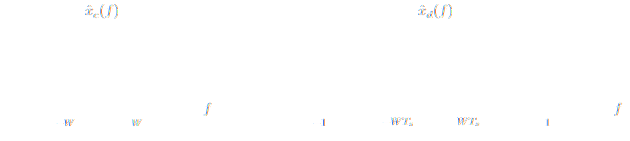

## **Linear Systems**
# **Laboratory Session 3**
_Academic year 2023-2024_

_Second Course GSC/GSA/GTT/GT/IT - Universidad Carlos III de Madrid_

---

The concept of sampling, which is the basis of many modern signal processing and 
communications systems, is to obtain a discrete sequence by taking uniformly spaced 
samples of a continuous signal. The sampling theorem ensures that, if the continuous 
signal is bandlimited and the samples are taken at a sufficiently high sampling rate, the 
continuous signal can be perfectly recovered from the discrete sequence of samples. This 
result can be used to implement a continuous system using its samples. The objectives of 
this practice are the following: 
 
* Understand the concept of sampling and the conditions imposed by the sampling 
theorem that allow you to retrieve the continuous signal from your samples. 
* Analyze the sampling process and signal reconstruction, both in time and 
frequency domain, paying special attention to the limitations introduced when 
simulating it in Matlab. 
* Observe what happens when the conditions of the sampling theorem are not met, 
and spectral overlap ("aliasing") appears.

# 1. Sampling a sinusoidal signal

The sampling theorem guarantees that a continuous signal $x_c(\cdot)$ that is band-limited to $W$ 
(i.e., $\hat{x}_c(f)=0$ for $f>W$) can be reconstructed perfectly from the sequence of samples 
$x_d[n]=x_c(nT_s), n\in \mathbb{Z}$ provided that $T_s \leq \frac{1}{2W}$. Otherwise, spectral overlap ("aliasing") 
will appear and the recovered signal will be different from the original.



In this section we try to corroborate these results using sinusoidal signals of the type:
$$x_c(t)=\cos(2\pi f_0 t), t \in \mathbb{R}$$
As already seen in the previous laboratory exercises, it is not possible to work directly 
with continuous signals in Matlab, but they can be accurately approximated by using a 
sufficiently large number of samples (that is, using a sampling rate much higher than the 
minimum given by the sampling theorem). Also note that, given the inverse time-
frequency relationship, for a continuous signal to be bandlimited, its temporal duration
must be infinite. Obviously, it is not possible to simulate this in Matlab, so the signal that 
you will work with will be:
$$\bar{x}_c(t)=x_c(t)p(t), t \in \mathbb{R}$$
for some rectangular pulse whose duration will depend on the simulated signal 
portion. Consequently, when working in the frequency domain, the Fourier Transform 
becomes
$$\hat{\bar{x}}_c(f)=\hat{x}_c(f) \ast \hat{p}(f), f\in \mathbb{R}$$
This fact must be considered when interpreting the computed Fourier Transforms.

Once the simulated continuous signal is constructed, it will be sampled using the 
following continuous-discrete converter (function `conv_cd`). The inputs of the function are 
the vector `xc`, which contains the samples of the continuous signal, the vector t containing 
the time instants corresponding to these samples, and the scalar `Ts` defining the sampling 
period. The outputs are the vectors `xd`, which contains the sampled sequence, and `tsamp`, 
which contains the sampling instants.

```matlab
function [xd, tsamp] = conv_cd(xc, t, Ts) 
% xc: continuous input signal (sample vector of the signal) 
% t: vector of time samples corresponding to the samples of the signal xc 
% Ts: sampling period 
 
% Time interval between the first and last samples of xc: 
T = t(end) - t(1); 
 
% Number of samples if sampling xc each Ts seconds (rounding to the bottom + 1): 
Ns = floor(T/Ts) + 1; 
 
% Prepare the vector xd with the first sample of xc and complete the remaining Ns-1 entries with zeros: 
xd = [xc(1) zeros(1, Ns-1)]; 
 
% Prepare the time sample vector tsamp with the first sample of t and the remaining Ns-1 entries with zeros: 
tsamp = [t(1) zeros(1, Ns-1)]; 
 
% Calculate the remaining values of xd and tsamp: 
for n = 1:Ns-1 
% Subtract from the values of t the value t(1)+nTs and calculate the absolute value of the difference 
% Compute the minimum value of the resulting vector to get as close as possible to the signal value at nTs 
% (loads the position of the nearest value in ind and the approximation error in delta): 
  [delta, ind] = min(abs(t-t(1)-n*Ts)); 
  xd(n+1) = xc(ind); 
  tsamp(n+1) = t(ind); 
end
```

Simulate and analyze the sampling process, both in time and frequency domain.

## Exercise 1
Simulate a sinusoidal signal with frequency $f_0=2 \text{Hz}$ and duration from $-1$ to $1$ seconds, 
generating a vector with 1001 samples. Use the `conv_cd` function to perform the 
continuous-discrete conversion of that signal with a sampling period of $𝑇_s=0.1$ seconds. 
Plot in the same figure the continuous signal in blue (using the **`plot`** command) and its 
discrete samples in red (with the **`stem`** command). Verify that the signal is sampled 
correctly, that is, that the amplitudes of the samples match the values of the signal at the 
sampling times.

## Exercise 2
Calculate the Fourier Transforms of the continuous signal $x_c(\cdot)$ and of the discrete 
sequence $x_d(\cdot)$ using the instructions of Laboratory Exercise 2. To this end, approximate 
the signal $x_c(\cdot)$ from the previous exercise (sinusoidal with frequency $f_0=2\text{Hz}$) for a 
duration from $-2$ to $2$ seconds using enough samples (say $\Delta_t = 0.001$) and numerically 
compute $x_c(\cdot)$ between $-3$ and $3$ using 1001 points. Next, sample the signal $x_c(\cdot)$ with a 
sampling period of $𝑇_0=0.1$ seconds to obtain $x_d[n]=x_c(nT_s), \in \mathbb{Z}$ and evaluate 
$\hat{x}_d(f)$ for $f \in [-1/2, 1/2]$ (as in Section 2 of Laboratory Exercise 2) using 1001 points. 
Using the **`subplot`** command, draw both Fourier Transforms in the same figure (but in 
different subfigures). Do the Fourier Transforms coincide with what you would expect 
from theory? Recalculate the Fourier Transform of the discrete sequence using $𝑇_s=0.01$. 
Does the obtained Fourier Transform resemble more closely the theoretical result?


# 2. Reconstruction of a sinusodial signal from its samples

To recover the continuous signal from the discrete sequence of its samples, we apply the 
interpolation formula
$$x_r(t) = \sum_{n=-\infty}^{\infty}x_d\left[n\right]h_r\left(t-nT_s\right), t \in \mathbb{R}$$
To achieve a perfect reconstruction, we would need to use the ideal reconstruction filter 
with impulse response
$$h_r(t)=\text{sinc}\left(\frac{t}{T_s}\right), t \in \mathbb{R}$$
In principle, the value of this impulse response for a set of time instants can be obtained 
by the Matlab command **`sinc`** if you have the Signal Processing Toolbox installed. If the 
**`sinc`** command causes problems, you can implement the sinc function directly in Matlab

```matlab	
function hi = filtro_ideal(t, Ts) 
% IDEAL RECONSTRUCTION FILTER: 
% t: vector of time samples. 
% Ts: sampling period of the original signal. 
% hi: impulse response of the ideal reconstruction filter. 
 
hi = Ts*sin(pi*t/Ts)./(pi*t); 
ind = find(t==0); 
hi(ind) = 1;
```

Unfortunately, the ideal filter is unrealizable in practice because of its non-causality and 
infinite duration. Consequently, in practice simpler reconstructive filters are often used, 
such as the *zero-order retainer*, whose impulse response is

$$h_0(t)=\left\{
\begin{array}{ll}
   1 & \text{if } 0\leq t \lt T_s \\
   0 & \text{if } t\geq T_s \\
\end{array} 
\right.$$

and whose implementation in Matlab is shown below:
```matlab
function h0 = filtro_orden0(t, Ts) 
% ZERO-ORDER RETAINER: 
% t: vector of time samples 
% Ts: sampling period 
% h0: impulse response of the zero-order retainer filter 
 
h0 = zeros(size(t)); 
epsilon = 1e-10; 
ind = find((t>=0) & (t<(Ts-epsilon))); 
h0(ind) = 1;
```

Another possibility is to use a linear interpolator, whose impulse response is 

$$h_l(t)=\left\{
\begin{array}{ll}
   1-\frac{|t|}{T_s} & \text{if } 0\leq t \lt T_s \\
   0 & \text{if } t\geq T_s \\
\end{array} 
\right.$$

Its implementation in Matlab is shown below:

```matlab
function h1 = filtro_lineal(t, Ts) 
% LINEAR INTERPOLATOR: 
% t: vector of time samples 
% Ts: sampling period 
% "h1": impulse response of the linear interpolator 
 
h1 = zeros(size(t)); 
ind = find(abs(t)<Ts); 
h1(ind) = (Ts-abs(t(ind)))/Ts; 
```
 
In these cases, the reconstructed signal will not exactly match the original, but the 
reconstruction error will be small if the sampling rate is large compared to the bandwidth 
of the signal. 

## Exercise 3 
Use the ideal reconstruction filter to retrieve the continuous signal generated in the 
previous exercise (i.e., a sinusoidal signal with frequency $f_0=2\text{Hz}$, duration from $-2$ to $2$ 
seconds, and $\Delta_t=0.001$ seconds) from two sequences obtained by sampling the 
continuous signal with sampling periods $T_s=0.1$ and $T_s=0.01$ seconds. Represent in the 
same figure, but in different subfigures, for both cases: the original continuous signal in 
blue (with the **`plot`** command), the sequence of samples in red (with the **`stem`** command), 
and the reconstructed signal in green (with the **`plot`** command). Analyze the 
reconstruction error obtained in both cases (you can zoom in on the figures to better see 
the error). What do you observe? 
 
## Exercise 4 
Repeat the previous exercise using the zero-order reconstructor and the linear 
interpolator. What do you observe? In which cases is it appropriate to use simplified 
reconstruction filters? 

# 3. Effects of incorrect sampling: "aliasing" 
 
When the continuous signal is not well sampled (i.e., sampled at a sampling rate lower 
than the minimum given by the sampling theorem) spectral overlap ("aliasing") will occur 
and the reconstructed signal will not match the original signal. This section explores the 
effects of “aliasing" working with sinusoidal and voice signals. 
 
## Exercise 5 
Generate a sinusoidal signal like that of the previous exercises (now with $f_0=5\text{Hz}$, 
duration from $-2$ to $2$ seconds, $\Delta_t=0.001$ seconds) and sample it at sampling period 
$T_s=0.25$. Retrieve the signal using the ideal reconstructive filter and draw in the same 
figure the original continuous signal, the sampled sequence, and the reconstructed signal 
(as you did in Exercise 3). What shape does the recovered signal have? Does it coincide 
with the original signal? To better appreciate this last part, it is advisable to calculate the 
Fourier Transforms of the original signal and the reconstructed signal and represent both 
in the same figure. 
The effect of incorrect sampling can be clearly seen when working with audible signals, 
as proposed in the following two exercises: 
 
## Exercise 6 
Generate a sinusoidal signal with frequency $f_0=2000\text{Hz}$ and duration from $0$ to $3$ 
seconds and play it using the **`sound`** command with three different sample frequencies 
$f_s=\frac{1}{T_s}$: $f_s=5000$, $f_s=3000$, and $f_s=2500\text{Hz}$. What effects do you observe on the 
frequency of the signals? Can you calculate the frequency of the played tones? 
 
## Exercise 7 
Load the signal “speech.wav” you have in Aula Global using the command **`audioread`**. This 
signal corresponds to a default speech. Check that the signal is sampled at a sampling rate 
of $f_s=16000\text{Hz}$, and check that you can reproduce that signal correctly. Then sample this 
signal using progressively lower sampling rates (say $f_s=8000\text{Hz}$, $f_s=4000\text{Hz}$,
$f_s=2000\text{Hz}$, etc.). For which sampling frequencies $f_s$ is there a clear decrease in quality of the 
voice signal? What conclusion can you draw about the bandwidth of the signal? 
 
**Note:** The process of reconstructing the voice signal from the samples may take several 
seconds. In this sense, it is recommended that the duration of the recorded voice signal 
does not exceed 2 seconds to avoid slowing down the process excessively.
